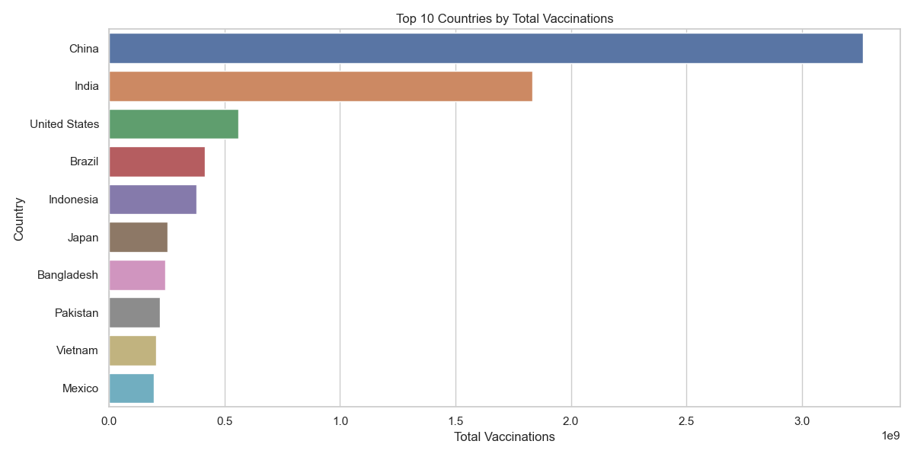
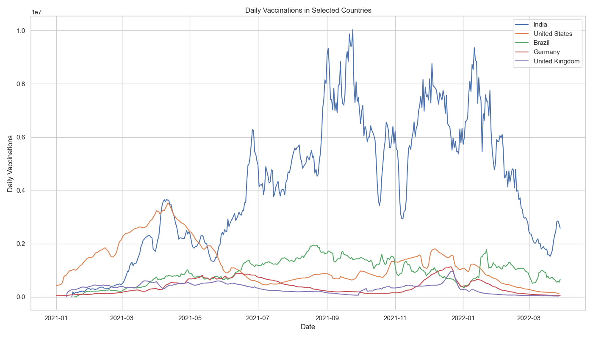
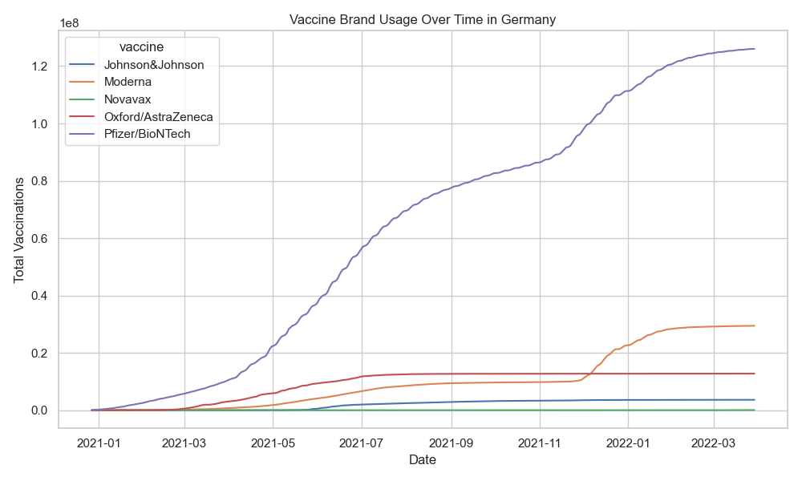

# COVID-19 Vaccination Data Analysis

## 📌 Project Overview

This project analyzes global COVID-19 vaccination progress using real-world data from Kaggle.  
The goal is to uncover trends, compare country-level responses, and visualize the impact of vaccination efforts.

## 📂 Data Sources

- [country_vaccinations.csv](https://www.kaggle.com/datasets/gpreda/covid-world-vaccination-progress): Total and daily vaccinations, per country
- [country_vaccinations_by_manufacturer.csv](https://www.kaggle.com/datasets/gpreda/covid-world-vaccination-progress): Vaccine brand-specific data

## 📊 Key Questions Answered

- Which countries vaccinated the most people?
- What is the trend of vaccinations over time in selected countries?
- How do vaccine brands vary by region?

## 🔧 Tools Used

- Python (Pandas, Matplotlib, Seaborn)
- Jupyter Notebook
- Data cleaning, aggregation, and visualization techniques

## 📈 Visualizations

### 🔹 Top 10 Countries by Total Vaccinations

### 🔹 Daily Vaccinations Trend (USA, India, Brazil, etc.)

### 🔹 Vaccine Brand Usage in Germany

## 💡 Insights

- The United States, India, and Brazil led total vaccine distribution.
- Germany used multiple brands like Pfizer, Moderna, and AstraZeneca with differing volume over time.
- Daily vaccination rates peaked during mid-2021 across many nations.

## 📁 Project Structure
